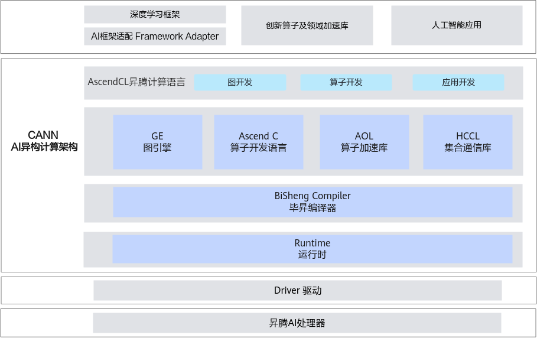

## CANN

#### 1.NPU是什么？NPU的优势？

NPU(Neural-network Processing Unit)，如昇腾AI处理器，是专门为AI计算，特别是神经网络运算而设计的AI处理器，相较于CPU(通用处理器)和GPU(图像处理器)，NPU的优势主要在于：

1. **高效、功耗低**：NPU内部集成了大量针对AI核心运算（如矩阵乘法、卷积、激活函数等）优化的计算单元，在处理特定任务时，比通用处理器更直接、更高效。由于专用设计，NPU在完成相同的AI计算任务时，功耗远低于CPU或GPU，这对于功耗敏感的边缘设备和需要大规模部署的场景至关重要。
2. **大规模并行处理**：NPU设计了大量并行处理单元，提升吞吐量。
3. **优化的数据流和内存访问**：NPU在架构上优化了数据在计算单元和内存之间的流动路径，减少了数据移动的延迟和开销。
4. **低延迟**：设计优化了专用数据通路，实现快速计算和响应。

#### 2.简单说明CANN的加速原理？

CANN的加速是一个多层次、协同工作的系统工程：

- **顶层接入与图构建**：通过AscendCL和AI框架适应层，方便将用户应用和标准AI框架模型接入CANN
- **图级优化**：GE图引擎是核心，他对计算图进行算子融合，内存优化，并行调度等一系列转换和优化。
- **算子级优化**：
  - 优先使用AOL算子库中预置的，针对昇腾硬件深度优化的高性能算子
  - 对于AOL未覆盖的算子，通过Ascend C算子开发语言开发硬件亲和的自定义算子
- **编译级优化**：毕昇编译器对优化后的图和算子进行微架构精准的编译，生成针对NPU硬件优化的可执行代码
- **执行级优化**：Runtime高效管理硬件资源，调度并执行编译后的代码，确保充分利用NPU
- **分布式加速**：HCCL为多NPU/多节点场景提供高性能的集合通信，解决分布式训练的通信瓶颈

> Author：wxtt-github
>
> 地址：https://github.com/wxtt-github/StereotypedWriting

