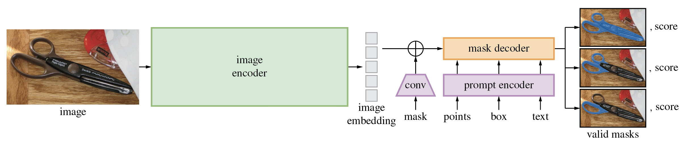

## ModelStructure

#### 1.CLIP


CLIP是一个多模态对比学习模型，核心是通过图像-文本对的对比训练，将视觉和语言特征对齐到共享嵌入空间。主要有三个特点：

1. **双塔结构**:独立的图像编码器(ResNet/ViT)和文本编码器(Transformer)。
2. **对比损失**:通过InfoNCE拉近匹配的图文对，推开不匹配对。
3. **Zero-shot能力**:利用自然语言提示(Prompt)直接适配下游任务，无需微调。

**1.图像编码器（Image Encoder）**

- **架构选择**
  - **ResNet变体**：
    - 使用Modified ResNet-50（添加Antialiased Blur Pooling）。
    - 最终全局平均池化后接线性投影层（如2048→512维）。
  - **ViT变体**：
    - 将图像分块为32*32的patch
    - 特殊处理：与标准ViT不同，CLIP的ViT不使用class token，而是用全局平均池化所有patch特征。
- **关键设计**
  - **归一化**：对输出特征进行LayerNorm，再投影到多模态空间
  - **分辨率适应**：推理时可临时增加输入分辨率（如ViT-L/14从224x224→336x336），提升细粒度特征。

2.**文本编码器（Text Encoder）**

- **输入处理**
  - Tokenization：采用BPE编码，最大长度76。
  - 特殊标记：添加[SOE]（开始）和[EOS]（开始），后者对应的输出向量作为文本表征。
- **Transformer配置**
  - 基于GPT-2架构：
    - 12层，512隐藏层，8头注意力
    - 使用GeLU激活函数而非ReLU
  - 因果掩码：训练时禁用未来信息，但实际使用时是双向掩码（因[EOS]依赖全文信息）。

**3.对比学习机制**

- **相似度计算**

  - 图像特征与文本特征计算余弦相似度矩阵
  - 温度系数τ：可学习参数（初始值0.07），用于调节分布尖锐程度

- **损失函数**

  - 对称交叉熵损失：同时优化图像→文本和文本→图像两个方向：

  ```
  loss_i2t = -log(exp(S_ii/τ) / ∑_j exp(S_ij/τ))  # 图像检索文本  
  loss_t2i = -log(exp(S_ii/τ) / ∑_j exp(S_ji/τ))   # 文本检索图像  
  loss = (loss_i2t + loss_t2i)/2  
  ```

  - 大Batch必要性：负样本来自同一batch，需足够大的batch（如32K）覆盖多样负例。

**4.Zero-Shot推理流程**

1. **Prompt模板化**：
   - 将类别标签（如"dog"）扩展为描述（如"a photo of a dog, {context}"）。
   - 上下文（context）可优化，如论文中使用的"a photo of a {}, a type of pet"。
2. **特征匹配**：
   - 计算测试图像特征与所有文本提示特征的余弦相似度。
   - 选择相似度最高的文本对应的类别。
3. **多Prompt融合**：
   - 对同一类别生成多个Prompt（如不同语境），取特征平均后比较。

**5.关键设计动机**

1. **为什么用对比学习？**
   - 分类任务受限于固定类别，而对比学习利用自然语言监督，实现开放词汇识别。
2. **为什么独立编码器？**
   - 分离模态编码更灵活（可替换架构），且避免早期模态融合的计算浪费。
3. **为什么大Batch训练？**
   - 对比学习依赖大量负样本，大Batch提供更均匀的负样本分布。

**6.局限性**

1. **数据效率低**：需400M（4亿）图文对才能达到良好效果。
2. **细粒度缺陷**：难以区分相近概念（如犬种细分）。
3. **Prompt敏感**：Zero-shot性能依赖提示词设计。

> 训练流程示例

**假设输入数据（Batch Size=4）**

| 图像（Image） | 文本（Text）             |
| :------------ | :----------------------- |
| 猫的图片      | "a photo of a cat"       |
| 狗的图片      | "a photo of a dog"       |
| 汽车的图片    | "a photo of a car"       |
| 飞机的图片    | "a photo of an airplane" |

**步骤1：特征提取**

1. **图像编码器**（以ViT为例）：
   - 每张图片分块→线性投影→Transformer编码→全局平均池化→得到4个图像特征向量 `I_1, I_2, I_3, I_4`（维度d=512）。
2. **文本编码器**：
   - 每个文本tokenized→Transformer编码→取[EOS]位置向量→得到4个文本特征向量 `T_1, T_2, T_3, T_4`（维度d=512）。

**步骤2：归一化与投影**

- 对 `I` 和 `T` 分别进行 **LayerNorm**，然后通过线性层投影到共享空间（保持d=512）。
- 最终得到归一化后的特征：
  - 图像特征：`I_i = Linear(LayerNorm(ViT(image_i)))`
  - 文本特征：`T_j = Linear(LayerNorm(Transformer(text_j)))`

**步骤3：计算相似度矩阵**

- 计算所有图文对的余弦相似度（cosine similarity），得到矩阵 `S ∈ R^(4×4)`：

  ```
  S[i][j] = (I_i · T_j) / (||I_i|| * ||T_j||)  # 点积后除以模长
  ```

- **示例矩阵**（数值为假设）：

  |         | T_1 (cat) | T_2 (dog) | T_3 (car) | T_4 (airplane) |
  | :------ | :-------- | :-------- | :-------- | :------------- |
  | **I_1** | 0.9       | 0.2       | 0.1       | 0.1            |
  | **I_2** | 0.3       | 0.8       | 0.2       | 0.1            |
  | **I_3** | 0.1       | 0.1       | 0.85      | 0.3            |
  | **I_4** | 0.1       | 0.2       | 0.4       | 0.9            |

**步骤4：对称交叉熵损失计算**

1. **温度系数缩放**：`S = S / τ` （假设τ=0.07，缩放后数值放大）。

2. **图像→文本损失（Image2Text）**：

   - 对每行（每个图像）计算softmax，目标标签为对角线位置：

     ```
     loss_i2t = -log(exp(S[i][i]) / sum(exp(S[i][:]))  # 对角正样本概率
     ```

   - 例如 `I_1` 的损失：

     ```
     loss_I1 = -log(exp(0.9/τ) / (exp(0.9/τ)+exp(0.2/τ)+exp(0.1/τ)+exp(0.1/τ))
     ```

3. **文本→图像损失（Text2Image）**：

   - 对每列（每个文本）计算softmax，目标标签为对角线位置：

     ```
     loss_t2i = -log(exp(S[j][j]) / sum(exp(S[:][j])))  
     ```

4. **总损失**：

   ```
   loss = (loss_i2t.mean() + loss_t2i.mean()) / 2
   ```

> 对称交叉熵的直观解释

- **对称性**：同时优化“图像找文本”和“文本找图像”两个方向，确保双向对齐。
- **对比学习本质**：
  - 正样本（对角线）相似度→尽可能高。
  - 负样本（非对角线）相似度→尽可能低。
- **温度系数τ的作用**：
  - τ越小，softmax分布越尖锐，对困难负例（高相似度的错误对）惩罚越强。

> 为什么用GeLU？

- 相比ReLU：在负区间保留部分梯度（非完全截断），缓解神经元死亡问题。
- 相比SiLU（Swish）：计算更高效，且效果接近。

#### 2.SAM



SAM是一种通用图像分割模型，旨在通过提示如点、框、掩码、文本(实际官方目前并没开源，效果不稳定)等对任意对象进行零样本（Zero-shot）分割，主要有三个特点：

1. **提示驱动分割**：支持点、框、掩码、文本等多模态提示。
2. **全图像分割**：可生产图像中所有对象的掩码（object propasals）/
3. **零样本泛化**：无需微调即可适配新领域数据（如医学图像、卫星图像等）。

**1. 模型整体架构**

SAM 由三个核心组件构成，形成 **“编码器-解码器-提示交互”** 的流水线：

**(1) 图像编码器（Image Encoder）**

- **主干网络**：基于 **Vision Transformer（ViT）** 的变体（ViT-H/16，参数量633M），输入分辨率1024×1024。
  - **改进点**：
    - 使用 **窗口注意力（Window Attention）** 降低计算复杂度。
    - 添加 **全局注意力层（Global Attention）** 维持全局上下文感知。
- **输出特征**：
  - 图像被划分为 **64×64的patch**，输出 **64×64×256** 的低分辨率特征图（原图的1/16）。
  - 通过轻量级 **neck层**（如FPN）进一步融合多尺度特征。

**(2) 提示编码器（Prompt Encoder）**

- **输入类型处理**：
  - **点/框**：通过位置编码（Positional Embedding）映射为256维向量。
  - **文本**：使用CLIP的文本编码器提取特征（与图像编码器对齐）。
  - **掩码提示**：通过卷积层编码为低分辨率特征（4×4×256）。
- **稀疏与密集提示**：
  - 稀疏提示（点、框）直接嵌入为向量。
  - 密集提示（掩码）通过卷积下采样后与图像特征融合。

**(3) 掩码解码器（Mask Decoder）**

- **轻量级Transformer架构**：
  - 由 **2层交叉注意力（Cross-Attention）** 和 **2层自注意力（Self-Attention）** 组成。
  - 查询（Query）是提示特征，键/值（Key/Value）是图像特征。
- **动态预测机制**：
  - 输出 **3个候选掩码**（对应不同分割粒度），并预测置信度分数。
  - 通过 **IoU回归头** 和 **分类头** 联合优化掩码质量。
- **分辨率恢复**：
  - 使用 **转置卷积** 将低分辨率掩码上采样至原始分辨率（1024×1024）。

**2. 关键技术创新**

**(1) 解耦的提示交互**

- 图像编码器仅运行一次，提示编码器动态处理用户输入，实现高效交互。
- **计算优化**：提示变化时仅需重新运行解码器（占整体计算量<1%）。

**(2) 数据引擎与训练策略**

- **三阶段训练**：
  1. **标注数据训练**：使用11M有标注图像（SA-1B数据集）。
  2. **半自动标注**：模型辅助标注新数据，迭代提升覆盖度。
  3. **全自动标注**：对无标注图像生成高质量掩码，扩充数据集。
- **损失函数**：
  - 线性组合 **焦点损失（Focal Loss）** 和 **Dice Loss**，优化掩码边界质量。

**(3) 零样本设计**

- **提示泛化性**：通过模拟多样化的提示（如随机点、噪声框）训练，增强鲁棒性。
- **多模态兼容**：文本提示通过CLIP编码器对齐，支持开放词汇分割。

**3 局限性**

1. **计算资源需求高**：ViT-H图像编码器推理需约3GB显存（1024×1024输入）。
2. **小对象分割不足**：低分辨率特征图（64×64）导致细节丢失。
3. **文本提示依赖CLIP**：文本分割性能受限于CLIP的语义对齐能力。

#### 3.DinoV2


#### 4.Qwen


#### 5.Qwen2


#### 6.Qwen2.5


#### 7.DeepSeek V3


#### 8.DeepSeek R1


#### 9.TTT


#### 10.Mamba


