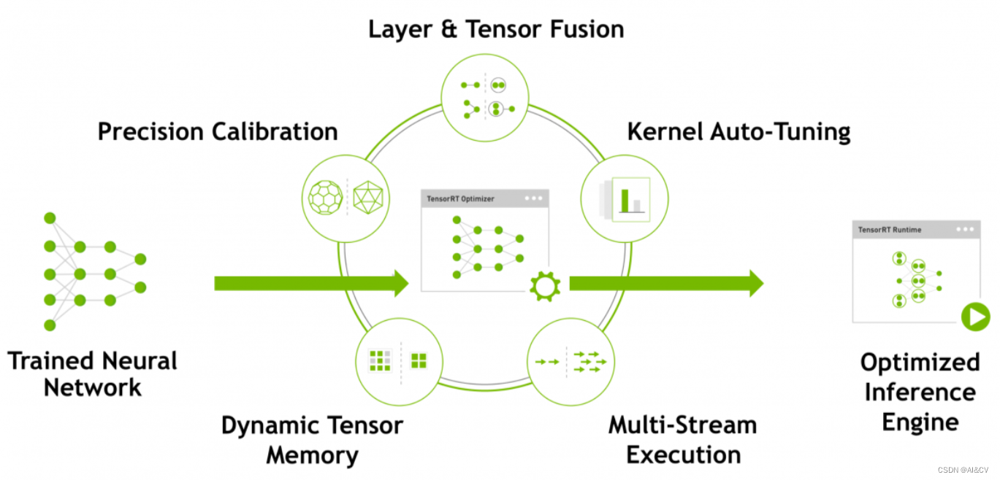
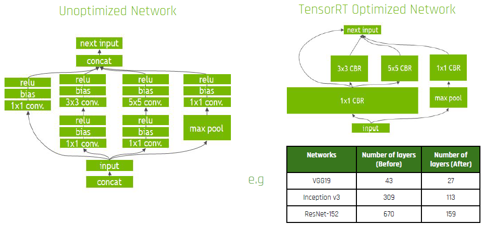
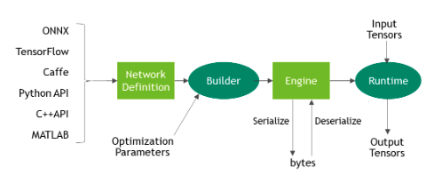

## TensorRT

#### 1.列举一些模型精度？他们的区别？

常见的模型精度有FP64、FP32、FP16、BF16、FP8、INT8、FP8、INT4、FP4、NF4，还有一个比较特殊的位数和名字不同的TF32。

| Type\Info | 符号位 | 指数位 | 尾数位 |
| :-------: | :----: | :----: | :----: |
|   FP64    |   1    |   11   |   52   |
|   FP32    |   1    |   8    |   23   |
|   FP16    |   1    |   5    |   10   |
|   BF16    |   1    |   8    |   7    |
| FP8 E4M3  |   1    |   4    |   3    |
| FP8 E5M2  |   1    |   5    |   2    |
|   INT8    |  0/1   |   \    |   \    |
|   INT4    |  0/1   |   \    |   \    |
|    FP4    |   1    |   2    |   1    |
|    NF4    |   \    |   \    |   \    |
|   TF32    |   1    |   8    |   10   |

> 解释一些典型的精度：

**BF16**

由1位符号位，8位指数位，7位尾数位构成，指数位与FP32一样，总位数与FP16一样，因此BF16表示范围与FP32一致，而精度比FP16要低。

**TF32**

TF32全名Tensor Float 32，是NVIDIA设计的一种特殊的类型，首次推出在A100上，虽然名字叫TF32，实际上只有19位，由1位符号位，8位指数位，10位尾数位组成，可以发现8位指数位与FP32对齐，而10位小数位与FP16对齐，因此他是FP32的表示范围和FP16的精度的一种平衡。

**NF4**

详情见2023年的[QLoRA论文](https://arxiv.org/abs/2305.14314)。

大致思路是将4位数字归一化到均值为0，标准差为[-1, 1]的正态分布上。

#### 2.解释TensorRT的加速原理？



**TensorRT的加速原理**主要在以下**五个关键技术**：

**1.图优化（Graph Optimization）**

- **层与张量融合（Layer & Tensor Fusion）**:优化的目标是要减少GPU核数的使用，以减少GPU核的数据读写次数，申请开销。

  

  + **垂直融合（Vertical Fusion）**：如上图所示，可以将一些连续的、可以合并的层融合成一个单一的层。例如一个卷积层（Conv）后面通常跟着一个偏置层（Bias）和激活层（ReLU），可以将其融合成一个单一的CBR层（Conv-Bias-ReLU），这样原先需要用在Conv，Bias，ReLU上的Kernel数就减少了2/3，进而减少了Kernel的启动开销，显存读写次数（因为中间结果可以直接在GPU的寄存器或共享内存中传递，而无需写回全局显存再读出）。

  + **水平融合（Horizontal Fusion）**：如上图所示，可以将一些输入相同、结构相同的并行层融合成一个更宽的层。例如图中将3个输入相同、结构相同的1\*1的CBR核，融合成了一个1\*1的CBR核。

  + **张量融合（Tensor Fusion）**：将逐元素的操作及其相关的张量操作尽可能地合并。

    例如我们有三个形状相同的张量A，B，C，需要执行三个操作：

    1. X = A * B
    2. Y = X + C
    3. Output = ReLU(Y)

    在这里乘法，加法，ReLU都是逐元素的操作

    >  若没有张量融合

    1. Kernel 1：从全局显存中读取A和B的对应元素，计算A[i] * B[i]，将结果X[i]写回全局显存
    2. Kernel 2：从全局显存读取X和C的对应元素，计算X[i] + C[i]，将结果Y[i]写回全局显存
    3. Kernel 3：从全局显存读取Y的对应元素，计算max(0, Y[i])，将结果Output[i]写回全局显存

    结果：

    1. 三次的Kernel启动，增加GPU的调度开销
    2. 多次显存读写，X，Y被写入全局显存然后又被读出

    > 若进行张量融合

    ```
    // FusedKernel(A, B, C, Output)
    // 假设 A, B, C, Output 都是指向GPU全局显存的指针
    // 并且已经正确处理了线程索引 (blockIdx, threadIdx) 到数据元素索引 (i) 的映射
    
    for each element i (processed by a CUDA thread):
        // 1. 读取输入 (只需要一次初始读取)
        float val_A = A[i];
        float val_B = B[i];
        float val_C = C[i];
    
        // 2. 执行乘法 (中间结果通常在寄存器中)
        float temp_X = val_A * val_B;
    
        // 3. 执行加法 (中间结果通常在寄存器中)
        float temp_Y = temp_X + val_C;
    
        // 4. 执行ReLU激活 (中间结果通常在寄存器中)
        float result = max(0.0f, temp_Y);
    
        // 5. 将最终结果写回全局显存 (只需要一次最终写入)
        Output[i] = result;
    ```

    结果：

    1. 一次Kernel启动
    2. 减少了显存读写，首先输入的A，B，C只需从全局显存中读取一次，中间结果temp_X和temp_Y不需要写入全局显存再读出，最终结果Output只需要写入全局显存一次

- **无效层消除（Dead Layer Elimination）**：移除网络中对输出没有贡献地层。例如再推理阶段，Dropout层通常是不起作用地，可以被安全移除。

- **常量折叠（Constant Folding）**：在编译器预先计算只依赖于常量的分支，并将结果直接替换到网络中，减少运行时的计算量。在onnxslim库中，也有这个优化。

- **Trick：**如上图所示，Concat层也被优化掉了，Concat处理数据的合并问题，TensorRT预先申请足够长度的缓存，将需要Concat的数据放到相应的位置，即可完成Concat算子的替代，减少Kernel的使用。

**2.精度校准与量化（Precision Calibration & Quantization）：**

- FP16：许多现代NVIDIA GPU对FP16计算有硬件加速，TensorRT将FP32的模型转为FP16，不仅计算更快，还减少了模型大小和显存占用，降低了显存带宽需求。
- INT8：更激进的量化策略，将FP32的权重和激活值量化到INT8可以带来显著的提升和更低的资源消耗。为了最大限度减少精度损失，TensorRT提供一个数据校准过程（Calibration），用户提供一小批有代表性的输入数据（校准数据集），TensorRT通过这些数据来统计各层激活值的分布，从而计算出合适的量化尺度因子（Scale Factor），确保量化后与原始模型在精度上尽可能接近。

**3.Kernel自动调优（Kernel Auto-Tuning）：**

- NVIDIA为不同的GPU架构，不同的层类型，不同的参数（如batch size，input size， filter size等）预先编写和优化了大量的CUDA Kernel，在构建引擎（Engine Building）阶段，TensorRT会根据目标GPU的具体型号和当前网络配置，从其Kernel库中选择或动态生成最优的Kernel，有时甚至会测试多种Kernel实现，选择在该硬件上表现最好的一个。

**4.动态张量显存（Dynamic Tensor Memory）：**

- TensorRT会分析模型的整个生命周期，智能地管理显存分配和服用，他会为中间张量分配最小必需的显存，并尽可能地复用显存，避免不必要地显存分配和拷贝，减少显存占用和延迟。

**5.多流执行（Multi-Stream Execution）：**

- TensorRT可以并行处理多个输入流，从而提高GPU地利用率和整体吞吐量。

#### 3.TensorRT的工作流程是怎么样的？



1. **模型导出：**从训练框架（如Pytorch、TensorFlow、Caffe等）中导出模型，通常导出为ONNX（Open Neural Exchange）格式。
2. **模型解析与构建（Build Phase）：**
   - **Parser：**TensorRT使用相应的解析器（如ONNX Parser）读取模型文件，将其转换为TensorRT内部的网络表示。
   - **Builder：**这是核心优化步骤。`INetworkDefinition` (网络定义) -> `IBuilderConfig` (构建配置，如最大工作空间、精度模式FP16/INT8) -> `IBuilder` (构建器) -> `ICudaEngine` / `IHostMemory` (序列化的引擎)。
   - 在这一步，TensorRT会进行图优化，精度选择（如果开启INT8，则需要校准），Kernel自动调优。

3. **引擎序列化与反序列化：**生成的优化引擎（`ICudaEngine`）可以被序列化到文件或内存中，下次使用时，可以直接从文件反序列化，跳过耗时的构建过程。
4. **推理执行（Runtime Phase）：**
   - **Runtime：**创建`IRuntime`示例。
   - **Engine Deserialization：**使用`IRuntime`反序列化引擎。
   - **Execution Context：**从`ICudaEngine`创建`IExecutionContext`。执行上下文包含了特定批次大小和动态维度下的状态。一个引擎可以有多个执行上下文，用于并发执行。
   - **Data Transfer**：将输入数据从CPU拷贝到GPU。
   - **Enqueue / Execute：**调用`enqueueV2() `(异步) 或 `executeV2()` (同步) 执行推理。
   - **Data Retrieval()：**将输出数据从GPU拷贝回CPU


> Author：wxtt-github
>
> 地址：https://github.com/wxtt-github/StereotypedWriting


